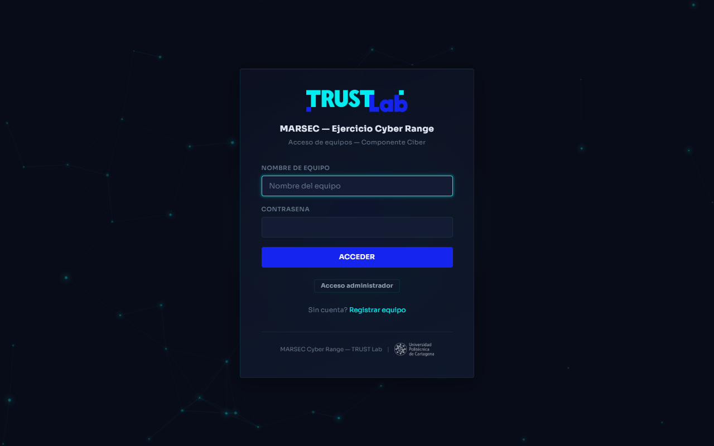
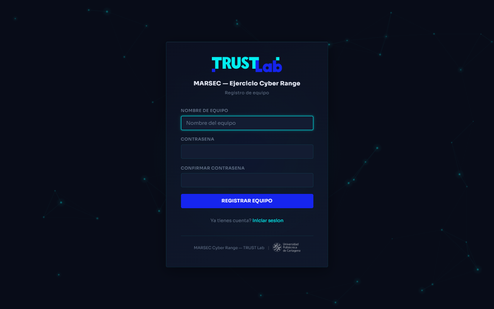
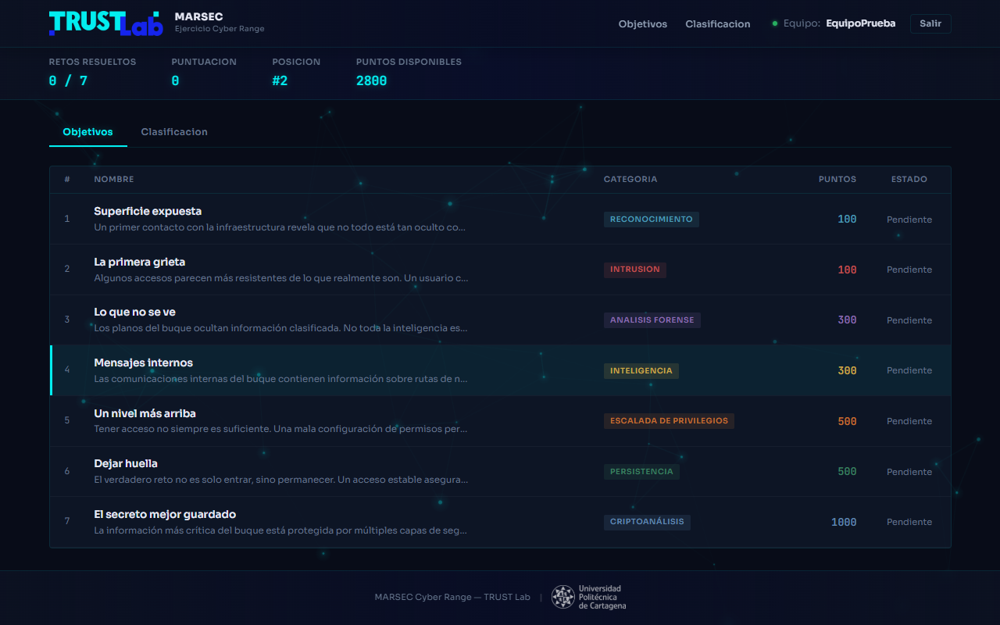
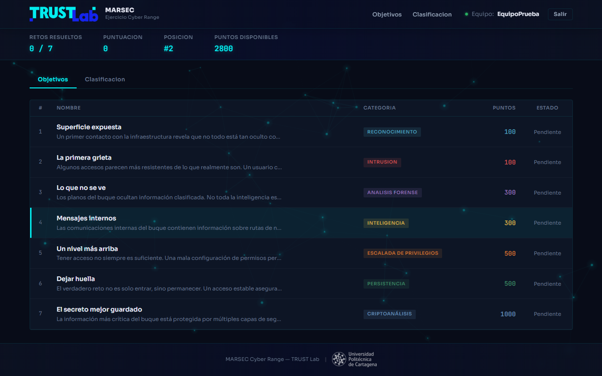
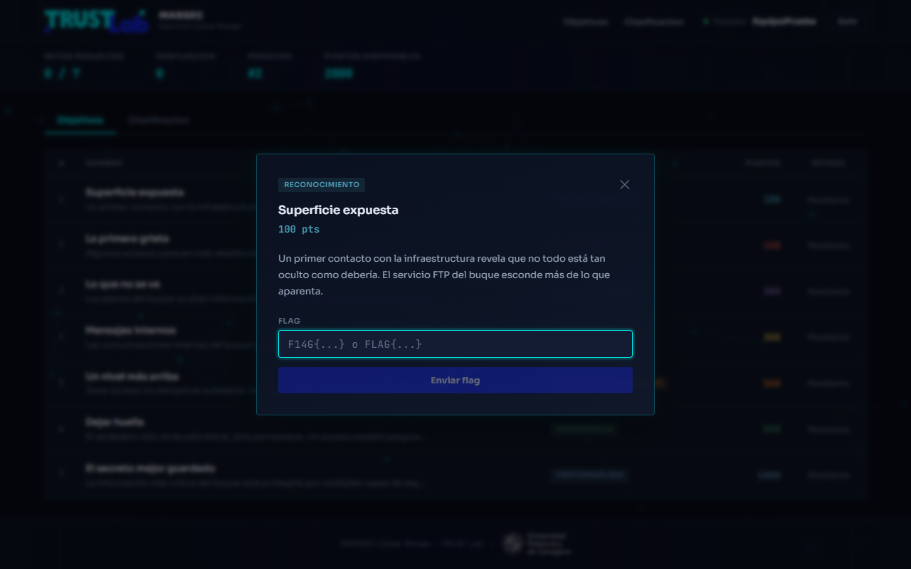
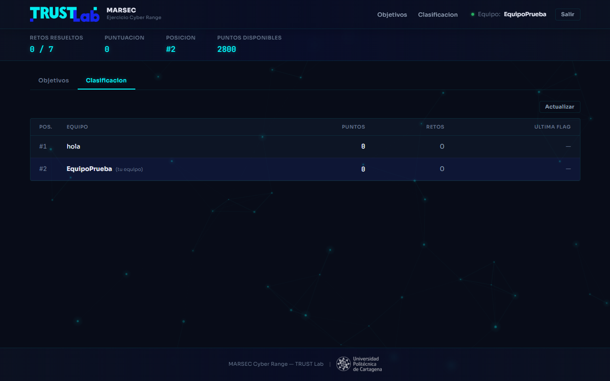
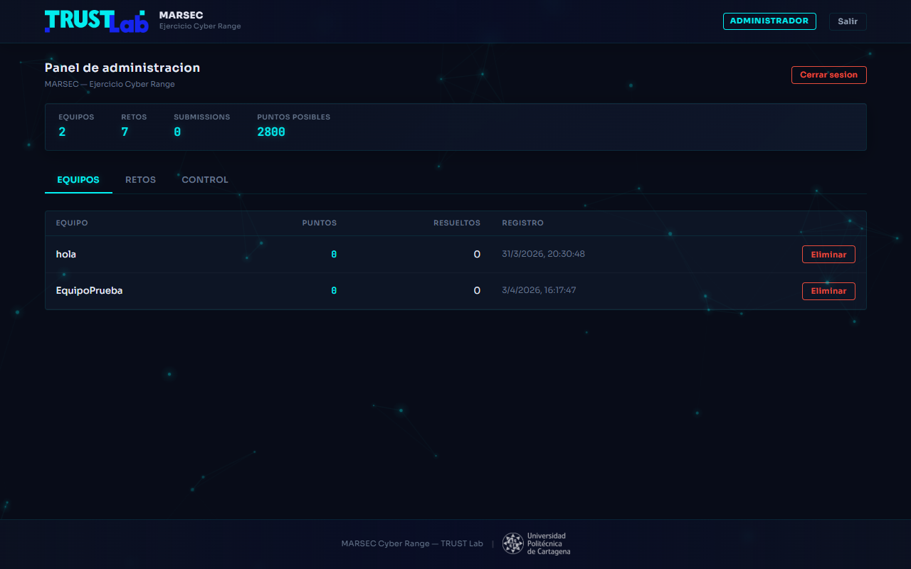
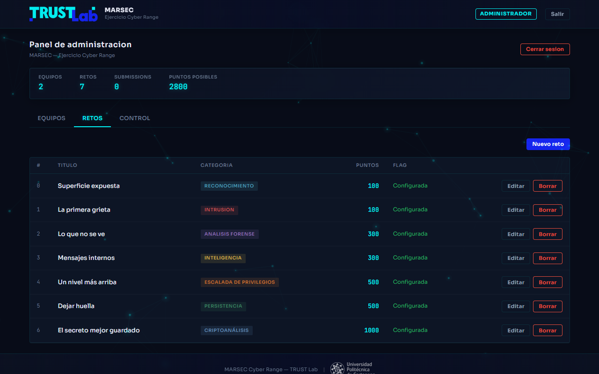
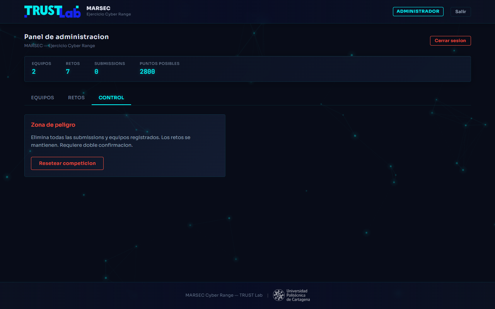

# MARSEC Cyber Range — Plataforma CTF
## Documentacion de la Interfaz Web

**Proyecto**: Plataforma CTF para el ejercicio MARSEC — Componente Ciber
**Desarrollado para**: TRUST Lab, Universidad Politecnica de Cartagena
**URL de produccion**: https://marsec.trustlab.es
**Stack tecnologico**: React 18 + Vite 5 (frontend) | Node.js + Express (backend) | JSON file DB

---

## 1. Identidad Visual

La plataforma sigue estrictamente el **Brand Book de TRUST Lab**:

| Elemento | Especificacion |
|----------|---------------|
| **TRUST BLUE** | `#02eef0` — acentos, highlights, glow, valores estadisticos |
| **LAB BLUE** | `#1625ee` — botones primarios, header, logo |
| **Fondo** | Dark mode `#080c18` con particulas animadas |
| **Tipografia** | Sora (UI) + JetBrains Mono (flags/codigo) |
| **Logo** | PNG oficial de TRUST Lab extraido del Brand Book |
| **Botones** | LAB BLUE fill, texto blanco, hover con glow TRUST BLUE |
| **Favicon** | Icono TL extraido del logotipo, fondo transparente |

---

## 2. Pantalla de Login



- **Logo TRUST Lab** centrado en la parte superior
- **Titulo**: "MARSEC — Ejercicio Cyber Range"
- **Formulario** con campos nombre de equipo y contrasena
- **Glassmorphism**: caja de login con efecto frosted glass y bordes semitransparentes
- **Fondo animado**: constelacion de particulas cyan con conexiones entre nodos (canvas fullscreen)
- **Glow radial**: gradiente LAB BLUE + TRUST BLUE detras de la caja de login
- **Footer**: MARSEC Cyber Range — TRUST Lab | Logo UPCT
- **Acceso dual**: boton para alternar entre modo equipo y modo administrador

---

## 3. Pantalla de Registro



- Misma estetica que el login con campos adicionales
- Validacion de contrasena (confirmacion)
- Restricciones: nombre 3-30 caracteres, contrasena minimo 4

---

## 4. Dashboard — Vista de Objetivos (Retos)



- **Navbar glassmorphism**: fondo semitransparente con blur, logo TRUST Lab, enlaces "Objetivos" y "Clasificacion" con underline animado al hover, nombre del equipo activo
- **Barra de estadisticas**: retos resueltos, puntuacion, posicion, puntos disponibles — valores en TRUST BLUE con text-shadow glow, fondo con gradiente sutil
- **Tabla de retos**: 7 filas con animacion staggered (entrada secuencial desde la izquierda)
  - Nombre + descripcion resumida
  - Badge de categoria con color unico por tipo (Reconocimiento, Intrusion, Forense, Inteligencia, Escalada, Persistencia, Criptoanálisis)
  - Puntos en fuente monospace con color de categoria
  - Estado: "Pendiente" o "Resuelto" con check verde
  - Hover: left-border glow TRUST BLUE + fondo sutil
- **Particulas animadas** visibles a traves de los elementos con glassmorphism

---

## 5. Footer con Logo UPCT



- Texto: "MARSEC Cyber Range — TRUST Lab"
- Separador visual
- **Logo oficial** de la Universidad Politecnica de Cartagena (blanco, fondo transparente)
- Fondo: gradiente horizontal con toque sutil de LAB BLUE

---

## 6. Modal de Reto



- **Glassmorphism**: fondo semitransparente con blur 16px
- **Animacion de entrada**: slide-up + scale desde abajo
- **Overlay**: fondo oscuro 55% con backdrop blur
- Badge de categoria + titulo + puntos
- Descripcion completa del reto
- Campo de flag en fuente monospace (JetBrains Mono)
- Placeholder: `F14G{...} o FLAG{...}`
- Boton "Enviar flag" en LAB BLUE con glow al hover
- Feedback visual: mensaje verde (correcto) o rojo con shake (incorrecto)
- Cierre: click fuera del modal o tecla Escape

---

## 7. Clasificacion (Scoreboard)



- Tabla con posicion, nombre equipo, puntos, retos resueltos, ultima flag
- **Equipo propio** destacado con "(tu equipo)" y fondo LAB BLUE sutil
- **Lider** (posicion #1): badge "LIDER" con animacion glowPulse infinita, puntos en TRUST BLUE
- Animacion staggered en las filas
- Hover: left-border glow + sombra sutil
- Click en equipo: despliega historial de flags enviadas
- Boton "Actualizar" para refresh manual (auto-refresh cada 30s)

---

## 8. Panel de Administracion — Equipos



- **Acceso separado**: admin / MARSEC_admin_2026
- **Badge ADMINISTRADOR** en TRUST BLUE con borde en el navbar
- **Estadisticas generales**: equipos, retos, submissions, puntos posibles — con clase `.glass` y animacion staggered fadeIn
- **Tabla de equipos**: nombre, puntos, retos resueltos, fecha de registro
- Accion: eliminar equipo (con confirmacion)

---

## 9. Panel de Administracion — Retos



- **7 retos configurados** (2800 puntos totales)
- Tabla: numero de orden, titulo, categoria (badge coloreado), puntos, estado de flag
- Acciones: editar / borrar por reto
- Boton "Nuevo reto" para crear nuevos
- Formulario de edicion: titulo, categoria, puntos, flag, descripcion
- **Sin campo de pistas** (sistema de hints eliminado por diseno)

---

## 10. Panel de Administracion — Control



- **Zona de peligro**: boton para resetear la competicion completa
- Elimina submissions y equipos, mantiene retos
- Doble confirmacion requerida (dos dialogos `confirm()`)

---

## 11. Efectos Visuales y Animaciones

### Fondo Animado (Constellation Network)
- Canvas fullscreen con `position: fixed`
- 55 particulas flotantes en TRUST BLUE (12% opacidad)
- Cada particula tiene glow radial pulsante (seno temporal)
- Lineas de conexion entre nodos cercanos (<160px)
- Movimiento continuo a 0.25px/frame
- Respeta `prefers-reduced-motion`

### Glassmorphism
- `backdrop-filter: blur(12px)` en navbar, stats bar, auth box, modal
- Fondos semitransparentes con gradientes diagonales
- Bordes TRUST BLUE a 10% opacidad
- Box-shadow con inset highlight blanco 4%

### Glow Effects
- `text-shadow` cyan en valores estadisticos
- `box-shadow` glow en botones al hover
- Focus ring cyan en campos de input
- `glowPulse` infinite en badge LIDER
- Inset left-border glow en hover de filas de tabla

### Animaciones de Entrada
- `slideInRow`: filas de tabla entran desde la izquierda (40ms stagger)
- `scaleIn`: auth box escala desde 96%
- `modalSlideUp`: modal sube 20px + escala desde 97%
- `fadeIn`: estadisticas con stagger de 100ms
- `overlayFade`: overlay del modal

### Micro-interacciones
- Botones: `translateY(-1px)` + glow al hover
- Nav links: underline sweep animado (scaleX 0 → 1)
- Cards: elevacion + glow sutil al hover
- Inputs: focus ring expandido con glow
- Tab activo: text-shadow glow

---

## 12. Arquitectura del Proyecto

```
ctf_platform/
  client/                  # Frontend React + Vite
    public/
      trustlab-logo.png    # Logo TRUST Lab (PNG oficial)
      upct-logo.png        # Logo UPCT (blanco, transparente)
      favicon.png          # Favicon 32x32 (icono TL)
      favicon-192.png      # Favicon 192x192
    src/
      components/
        Navbar.jsx          # Navegacion glassmorphism
        ChallengeCard.jsx   # Tabla de retos con stagger
        ChallengeModal.jsx  # Modal de envio de flags
        Scoreboard.jsx      # Clasificacion con LIDER badge
        TeamHistory.jsx     # Historial de flags por equipo
        ParticleBackground.jsx  # Canvas constellation animada
      pages/
        Login.jsx           # Acceso de equipos/admin
        Register.jsx        # Registro de equipos
        Dashboard.jsx       # Vista principal con objetivos/clasificacion
        Admin.jsx           # Panel de administracion
      styles/
        index.css           # Design system completo
      App.jsx               # Router + ParticleBackground global
      main.jsx              # Entry point
  server/                   # Backend Express
    routes/
      auth.js, challenges.js, scoreboard.js, admin.js
    middleware/
      auth.js, rateLimit.js
    server.js, db.js
  data/                     # Base de datos JSON
    challenges.json, teams.json, submissions.json, admins.json
```

---

## 13. Retos Configurados

| # | Nombre | Categoria | Puntos |
|---|--------|-----------|--------|
| 1 | Superficie expuesta | Reconocimiento | 100 |
| 2 | La primera grieta | Intrusion | 100 |
| 3 | Lo que no se ve | Analisis forense | 300 |
| 4 | Mensajes internos | Inteligencia | 300 |
| 5 | Un nivel mas arriba | Escalada de privilegios | 500 |
| 6 | Dejar huella | Persistencia | 500 |
| 7 | El secreto mejor guardado | Criptoanálisis | 1000 |

**Total**: 2800 puntos | **Formato flag**: `F14G{...}` o `FLAG{...}` | **Verificacion**: SHA256 con salt

---

## 14. Despliegue

- **Docker**: `Dockerfile` + `docker-compose.yml` en la raiz del proyecto
- **Produccion**: https://marsec.trustlab.es (hosting externo)
- **Desarrollo**: `node server/server.js` (puerto 3000) + `npx vite` en `client/` (puerto 5173)

---

*Documentacion generada para TRUST Lab — Universidad Politecnica de Cartagena*
*Ejercicio MARSEC Cyber Range 2026*
